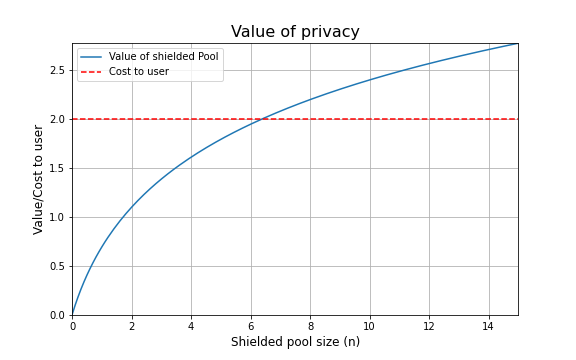
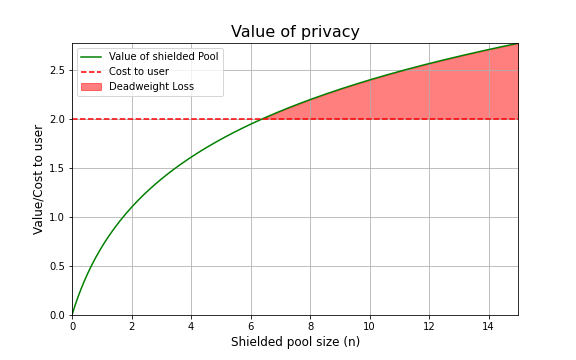
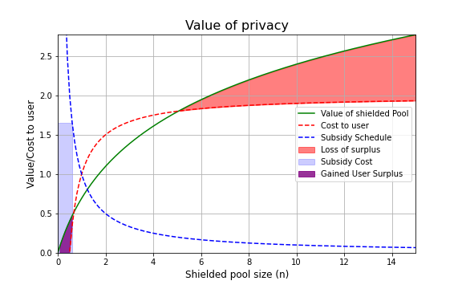
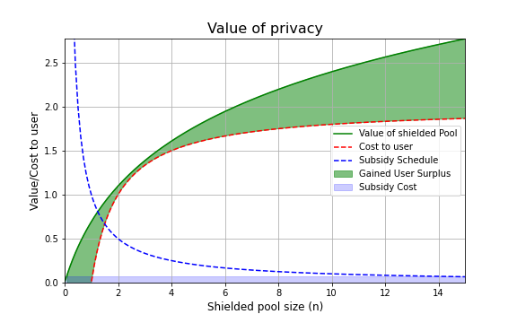
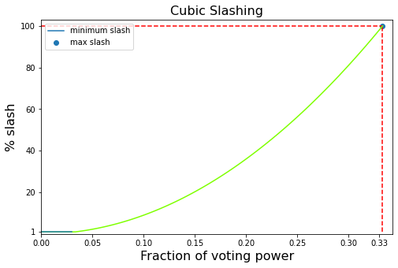
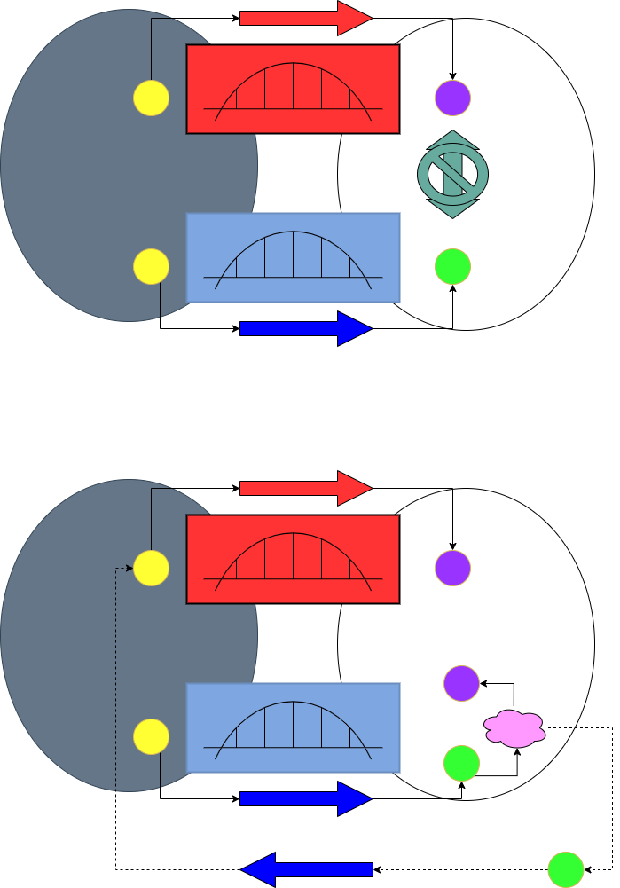

# Namada Whitepaper

# Clearing up the confusion
## Anoma or Namada?
**Anoma** is an ecosystem architecture that facilitates the operation of networked *fractal instances*. An example of a fractal instance is a sovereign blockchain that incorporates the Anoma consensus and execution model is **Namada**.
# Background and motivations

Transparency and privacy are two ends of a double edged sword. Transparency enables trust by enforcing easily-verifiable honesty, but fundamentally limits expressiveness. Any activity that cannot be publicised globally and permanently becomes inevitably supressed. Granted, for a subset of activity, this suppression may come as a feature, rather than a bug, as it forces illegal and malicious off the system. On the other hand, an arguably large subset is caught in the crossfire, ranging from medical records and political opinions to everyday transactions. As soon as there exists **one** party from which information must be withheld (on a global scale), a fully transparent model becomes unviable. We present Namada, an open-source, privacy-focused, blockchain that provides in-built optional privacy for users. Namada inherits the properties of a transparent system in being verifiable, trustless and censorship-resistant at a global scale, without sacrificing expressiveness by guaranteeing privacy by default. In this paper, we first outline the features of Namada. We then outline the stack and architecture in more detail, including high-leveled explanations for the cryptography involved. We conclude with the future roadmap and how we envisage Namada evolving.

## The importance of privacy in today's economy
As computational power and data storage improves, the world realises that there is a large amount of valuable information that we, whether we would like to or not, emit. This information has many use cases. On one hand, the information can be used to predict and protect us from pandemics[@pinter2020covid], to learn about our biases [@stephens2018everybody], and help direct more relevant ads [@chickering2013decision]. But as we have learnt, it can also be used in order to influence our political decisions [@isaak2018user], collect and distribute our healthcare data without our consent [@barassi2017babyveillance], and help direct more relevant ads [@evans2009online]. Our transactions in particular, are being monitored increasingly [@efanov2018all]. We do not believe that this is necessarily a bad thing. However, we do believe that we, as people, should have the discretion of who is able to collect and monitor the information we emit (and what information we emit). This is the primary motivation for Namada.

## Privacy as a public good

We believe that privacy should be subsidised and motivate this opinion in the following section.

In contemporary economics, a good is classified as a *public good* if it is **non-rivalrous** and **non-excludable**. Put simply, a good is non-rivalrous if its consumption by one person does not prevent its consumption by another person. A good is called non-excludable if its consumption cannot be prevented by any person once it exists. 

Strictly speaking, privacy itself is not a public good because although it is not rivalrous it *is* excludable. Preventing users from entering the shielded pool is trivial. However, it nonetheless exhibits a property commonly associated with public goods, namely having positive externalities. This occurs when one person's consumption of the good benefits another person, and this positive externality is indeed non-excludable. More concretely, when one user enters the shielded pool, it increases the total privacy for everyone within the shielded pool already, and it is impossible to exclude anyone already in the shielded pool from benefiting from it.

### Privacy's Positive Externality

The positive externality can be explained with a toy example (and accompanying diagram).

For the sake of simplicity, assume each "agent" in the economy is identical in terms of their preferences. We assume that the user values the opportunity to exist in a privacy set, and that the value of teh privacy set increases as the privacy set grows in size. Trivially, a privacy set of 0 people is worth nothing. Further, we assume that each additional increase in the size of the privacy set has a "decreasing marginal benefit" property, in the sense that each additional user contributes less to the overall privacy as a whole. As the privacy set grows infinitely large, the additional benefit of having someone enter the set becomes negligible. In economics, we tend to represent this through a "utility" function, that simply exists in order to measure cost and value for the agent. A natural choice for a utility function that exhibits the above properties is given by $$ U(n) = \ln (n) $$, where $n$ is the size of the privacy set. Although this is discrete, for simplicity, we will work in the continuous domain.

Additionally, we assume that there exists some unavoidable "cost" $c$ to the user for entering the privacy set. In the real world, this can correspond to learning about zero-knowledge cryptography, handling private keys, and other forms of "effort" and risks that the user may take along the journey. 

Because of the positive externality associated with entering the privacy set, there is "unrealised value" that is lost in the economy if users are unable to coordinate. Whilst no other user is in the privacy set, the value of the privacy set is 0, In contemporary economics, this "lost value" (shown by the shaded area between the value and the cost of entering) is referred to as "deadweight loss".

Therefore, if the protocol can incentivise a number of users (with ample sizes of assets) to enter the privacy set such that there is sufficient value in entering the privacy set, the coordination problem is solved. If the "social planner" was in full knowledge of exactly the amount of users needed in order to achieve this value $n^*$, she could offer exactly the correct amount of subsidy to incentivise the first $n^*$ users to use the protocol and nothing more.

### Correcting the externality

We suggest an alternative approach, whereby we can claim that:

If the subsidy $s(n)$ is such that $s(n) \propto \frac{1}{n}$, then for a sufficiently large constant of proportionality, the subsidy will incentivise the correct number of users to join the system. Additionally, this incentive scheme comes with the added benefit of being finite and predictable. This is not the only possible solution, but is one of them and seems natural.

The above subsidy is not sufficient in incentivising users to join the network, although it does lower the threshold slightly. In the above example, the size of the privacy set would increase from 0 to ~0.6. In order to reach the critical mass, we need to incentivise for a privacy set of at least size $n \approx 5.4$

If we increase the incentive to be exactly proportional to the cost for the user, it suffices. An additional nice property with desigining the subsidy in this way is that the subsidy becomes easily interpretable; the total subsidy is exactly the cost to any single user, distributed across all users.

Now the point minimising the areas between the curves is given by $ \ln(x+1) - c + \frac{k}{x} = 0$ (The derivative of the integral).

This gives a set of valid points. Now, additionally, ideally, the solution is tangential to the utility curve at the intersection.

$\frac{\partial}{\partial x} \ln(x+1) = -\frac{\partial}{\partial x}\frac{k}{x} \Leftrightarrow x^2 -kx - k = 0$

These two simultaneous equations can be solved for $k$. Alternatively, one can solve the first equation, but forcing the determinant to be zero. These two methods should give equivalent solutions.

# User Features

## Validity Predicates (VPs)

Validity Predicates are the backbone of Anoma-based blockchains.
In general, validity predicates specify which state changes relevant to state that it "owns" are valid in the blockchain. "Ownership" in this sense is an overloaded term, and is borrowed from its use in programming languages, where a variable can be "owned" over the runtime of a program. Validity predicates generally have "ownership" over state that it has created. For User Validity Predicates, this involves all the references to the Validity Predicates address. 

In Namada, a user can modify their validity predicate in order to have control over:

1. Account addresses that are allowed to be involved in asset transfers with the user
2. Token addresses that may attach a balance to the user's account address (i.e what tokens can be received by the user)
<!-- TODO: More functionality? -->

*Note that unlike Anoma-based blockchains in general, all Namada validity predicates are transparent.

Validity predicates grant users functionality that is usually unavailable in other blockchains due to fundamental design choices in the VM. This functionality allows users to easily blacklist and whitelist both users and tokens. An important and relevant use case for this functionality is complying with regulatory requirements. 

### WASM interpretation
All Namada transactions are interpreted in WASM form. This means that each Validity Predicate is compatible with validating any arbitrary transaction in WASM form. This gives developers greater flexibility, as it does not force any particular form of compiler to specific byte-code interpretation.

<!-- This section needs work but I don't know enough about it -->

## Multi Asset Shielded Pool (MASP)

The Multi Asset Shielded Pool (MASP) is the primary feature that Namada offers. The MASP is inspired by the work produced by the Electric Coin Company, and implements the ideas of the Sapling Circuit directly. More specifically, it was inspired by [Daria's insightful issue on the Zcash github repo](https://github.com/zcash/zcash/issues/2277#issuecomment-321106819). We acknowledge the importance of this work and therefore [propose](https://hackmd.io/GgZXWTDSSB6hp33FAFybFw?both) to offer the ECC team tokens of appreciation at our genesis block.

At a very high level[^1], the MASP works in the following fashion:

There exists two separate sets:
1. The shielded set
2. The transparent set

### Transparent set
From a user perspective, all tokens held in the transparent set are equivalent to holding tokens in any other transparent ecosystem. The functionality available to users are transfering assets from one address to another address, as well as bridging assets across the bridges deployed on Namada.

### Shielded Set

#### **Shielding assets**

Assets are minted into the shielded set from a valid zero knowledge proof that produces a "note".
The zero knowledge proof is meant to prove a set of things:
1. The base currency in which the note will be denominated
2. The value of the currency 
3. The address to which the note is owned
4. (Optionally) The epoch in which the note was minted [^2]

The underlying asset is sent to escrow.

[^1]: For more details, see [@hopwood2022zcash]

[^2]: The reason for this has to do with providing rewards for contributing to the shielded set

#### **Transferring Assets**
Notes are transferred by constructing zero knowledge proofs that are able to nullify notes and mint them under the ownership of the receiver.

#### **Unshielding assets**
The user unshielding assets publicly reveals the information used in the minting process, in addition to its nullifier. Once this information is verified, the user is able to take ownership of the equivalent asset in the escrow contract, in addition to any allocated awards from the Convert Circuit [^3].

[^3]: See the relevant section for more information on the Convert Circuit

## Convert Circuit (CC)

At a high level[^4] the Convert Circuit is a special feature added to the MASP Circuit, which is handled by a native Validity Predicate. More specifically, the validity predicate ensures that conversions occur according to a predefined public *conversion table*.

[^4]: A more detailed description is given under the Stack and Architectural Details section

At a high level, the convert circuit enables assets to be converted without needing to leak privacy through unshielding and or revealing any metadata. Note that these conversions are conversions in the truest sense of the word, and accomplishes the conversion through a mint and burn mechanism, meaning that there is no need for a liquidity pool or counterparty at all, since conversions are exactly that, conversions, not swaps. This is an important feat, as it is essential for making sense of any unified shielded pool. Granted, without the convert circuit, the MASP gives the benefit of a unified shielded set, which is important for assets with low trading volume, but this further allows for swaps and transfers that extend the reach of privacy to much greater functionality (discussed in the applications section).

In Namada, the convert circuit exists in order to provide rewards for shielded assets that are maintained in the shielded pool. This acts as a subsidy for reasons of correcting positive externalities. This is discussed more in detail [here](https://youtu.be/hwa-SBbXToA?t=8655).

This is achieved by allowing the following idea:
1. Each asset is attached to its epoch
2. Assets may be converted across epochs
3. The conversion factor is 1-1 plus additional subsidy NAM tokens

Pretty neat huh? I provide a concrete example below, but otherwise I recommend [this video](https://www.youtube.com/watch?v=r25azD2MFnI), [these specs](https://specs.namada.net/masp/burn-and-mint.html), as well as my attempt at a summary in the lower level section below to learn more.

:::info
Example:

1. Alice shields 100 epoch_1 NAM tokens in epoch 1
    - Alice is aware of the CC conversion table publicly available that gives her 1 NAM per 100 NAM she holds in the shielded set per epoch
2. In epoch 2, Alice makes a shielded transfer through the convert circuit, which gives her 100 epoch_2 NAM plus an additional 1 epoch_2 NAM (total 101 epoch_2 NAM)
:::

This is used in order to calculate the relevant NAM tokens that are distributed as part of Namada's subsidy for holding assets in the privacy set.
## Trustless Bridges
We recognise that having secure, isolated bridges is a vital component in paving the way towards a multi-chain future. Given the risks associated with Bridges, we believe that users should not need to place additional trust assumptions when interacting with them. Unlike when using third-party bridges, the user will only need to trust the validators on Namada as well as the Namada on the originating chain of the asset. These are unavoidable trust assumptions. Because of the lack of additional trust assumptions, we call these briges *trustless*. 

Trust assumptions when using bridges in general:

$\text{Trust System} = \min(\text{Trust}(\text{Bridge Operators},\text{Trust}(\text{Source Chain}), \text{Trust}(\text{Destination Chain}) \Rightarrow \\
=  \min(\text{Trust}(\text{Source Chain}), \text{Trust}(\text{Destination Chain}))$

More specifically, take the Ethereum bridge as an example. Validators on Namada will be running Ethereum full nodes, and will be tasked with listening for relevant events on the governance-specified bridge contract. The block proposer will then include the relevant transaction on the Namada consensus process. Once consensus threshold has been reached on validating the deposit, the block proposer is incentivised to include a transaction that will allow the user to "mint" a corresponding value of equivalent asset on the Namada side.

Similarly, the reverse process will allow for withdrawals of deposits on the Ethereum side, whereby validators are tasked with initialising the transaction that allows the user to withdraw the correct amount of asset from the Ethereum bridge contract.

## Inter-Blockchain Communication (IBC) Integration

Namada's interblockchain communication transactions are handled through a native IBC Validity Predicate.

The IBC validity predicate checks if an IBC-related transaction satisfies IBC protocol. For example, if an IBC connection end is created in the transaction, the IBC validity predicate validates this creation. If the creation with `MsgConnectionOpenTry` is invalid, e.g. the counterpart connection end doesn't exist, the validity predicate rejects the transaction and forces it to fail.

IBC token transfers are constructed according to [ICS20](https://github.com/cosmos/ibc/blob/master/spec/app/ics-020-fungible-token-transfer/README.md).

<!-- Also requires more work -->

# Governance

## Public Goods Funding (PGF)
Namada's existence relies on its open-source software stack, research, and ecosystem tooling all of which have relied on standing on the shoulders of other open-source information, readily available to the public through the internet. All of these foundations share the common attribute of being non-rivalrous and non-excludable, which are sufficient charactersitics to define them as public goods.

It is a well known concept in the economics literature that public goods tend to be underfunded due to these qualities. In short, this occurs because of coordination problems between individuals, whereby equilibrium market prices do not reflect the benefit the goods existence brings to the society as a whole, but rather the sole buyer of the good. 

One proposed solution to avoid such coordination failures is to subsidise such goods in a way that allows individual incentives to align with that of the public.

There will be a periodically elected council tasked with voting on projects/goods that should be funded.

The council is responsible for two types of public goods funding.

1. Continuous funding - in order to fund ongoing public goods projects in order to assist their coming to fruition
2. Retroactive funding - in order to fund completed and easily evaluated public goods, in order to incentivise future public goods to be built

Funding public goods is sourced through native asset (NAM) inflation, dictated by the protocol.

At the time of writing, 10% annual inflation is dedicated towards PGF.

## Retroactive PGF
Retroactive public goods funding has become an increasingly popular method for funding public goods. By retroactive, we mean to say funding goods in a post-fruition fashion. Goods receive a lump-sum subsidy in proportion to their perceived social utility at some point in time in which the perceived utility is believed to be more aligned with its potential social utility.

The benefit of this method of PGF is that it is often more clear to evaluate the benefit public goods have brought to society after-the-fact.  Because of the nature of public goods being non-excludable, its benefit to society is a function of the number of people that use it, which may not be obvious at first. Especially for public goods that have utility which is multiplicative to the number of people that make use of it (e.g the internet), retroactive funding is an especially useful tool. In this way, uncertainty is factored out in an important way.

The cons with retroactive PGF are two-fold. 

1. Retroactive PGF only allows for ex-post assessment of projects at the time the assessment is being made. This means that any public good that was unable to come to fruition because of a lack of funding or other circumstances, as well as any counterfactual of the good not existing, is ignored

2. Increased trust assumptions. In order for rPGF to correctly function as an incentive mechanism for the entrepreneur (agent) to take on risk in diverting resources to the project, the agent must be confident that the rPGF assessment mechanism will both work correctly and exist in the future at the time the assessment will be made. This may be able to be offset by some additional reward, but with risk-averse agents, this reward will have to be inefficiently allocated.

### Figuring out the right amount of funding

We will assume an economic agent that is both rational and risk-neutral. This means that the agent is trying to maximize the reward in expectation. A risk-averse agent will inevitably require more funding.

We will assume a risk-free interest rate $r$ that remains constant over time. This is a simplifying assumption that only affects the complexity of the equation.

The agent is considering investing in a public goods project. The agent assesses the probability of the project being successfully funded by the rPGF council at some rate $0<s<1$. Note that the success rate $s$ includes both 
1. the inherent risk of the project itself as well as 
2. the risk attached to the rPGF council existing and functioning properly at the time of assessment. 

The project comes at one-time sunk cost $C$ (which includes the opportunity cost to the agent of choosing this endeavour over any other).

Additionally we assume that the ex-post benefit to society $U$ at the time of assessment $T$ is greater than the cost of investing in the project (so that the rPGF council will find it worth funding ex-post). 

$$U > C(1+r)^T$$

An agent will be incentivised to invest in their project if funding retroactively directed to the project $F$ is at least as high as their costs.

$$ sF \geq C(1+r)^T \Rightarrow F \geq \frac{C}{s}(1+r)^T $$

If the agent is risk-averse, then this becomes more complicated. A common way to measure risk aversion is to assign the agent a utility function
$$u(c) = \begin{cases}
\frac{c^{1-\eta}}{1-\eta} &\text{if }\eta \geq 0 \text{ and } \eta \neq 1\\
\ln(c) &\text{if } \eta = 1
\end{cases}$$
(known as [isoelastic utility](https://en.wikipedia.org/wiki/Isoelastic_utility)).

In non-nonsense speak, this basically means that the agent is sensitive to uncertainty, and this risk-averseness is captured by $0\leq \eta \;\; ; \eta \neq 1$—the bigger $\eta$, the bigger the aversity to risk. For the case $\eta = 1$, the effect is that doubling the expected reward increases the utility of the risk-awerse agent only by a additive constant. 

Then we have 
$$ \frac{(sF)^{1-\eta}}{1-\eta} \geq C(1+r)^T \Rightarrow F \geq \frac{1}{s}\big((1-\eta)C(1+r)^T\big)^\frac{1}{1-\eta}$$

There is an extensive literature in estimating $\rho$, and estimates vary wildly. [Groom and Maddison](https://link.springer.com/article/10.1007/s10640-018-0242-z) estimated the value to be around 1.5 for the United Kingdom.

As $s$ approaches $1$, we begin to move towards a world where retroactive funding achieves all the benefits of continuous funding, whilst also maintaining its advantage of filtering uncertainty at no additional premium (since if F is large enough this is true regardless). The premium needed whilst $s<1$ will depend on the risk-averseness of the agent, and could be mitigated by the existence of insurance, should a market for that exist.

## Continuous PGF

Continuous PGF is meant to assist public goods coming to fruition. Every quarter, the council votes and decides on a group of public good projects that will receive up to 5% of the annual inflation distributed continuously over that quarter. The benefit of continuous funding include but is not limited to:

1. Since the money is received up front, the entrepeneural agent is less concerned with the possibility of not receiving funding despite the success of the project. Therefore it comes at a lower 

2. In an economy where the entrepreneurial agent is unable to take loans at a reasonable price (either because lenders do not have enough faith in the rPGF system or because the agent is unable to provide sufficient collateral), an agent that would be unable to pursue the endeavour is more likely to pursue it.

On the other hand, there are inevitable costs:

1. The council takes on additional risk, since the benefit of the good is less clear without the benefit of hindsight. 
2. A lack of incentive for commitment by the agent, which can lead to uncompleted projects. 
3. Increased uncertainty in evaluating the council's decisions as speculation is harder to assess. This places greater trust assumptions on the council acting faithfully.

## Four goals of PGF
Public goods funding is intended to be directed to the four following categories.

For development related to Namada/Anoma ecosystem:

1. Technical research related to Namada/Anoma, e.g research in cryptography, distributed systems, consensus mechanisms, 

2. Engineering related to Namada/Anoma, including but not limited to the user-interface, storage/throughput optimisation, bug-fixes and can be distrubted through e.g developer grants, bug bounties, etc 

3. Social reserach related to Namada/Anoma, more specifically resarch exploring the relationship by the technology and humans. This may be how privacy affects interactions e.g artist grants etc

For public goods not directly related to Namada/Anoma:

4. External public goods - e.g carbon capture, independent journalism, direct cash transfers 

More detailed information can be found at specs.namada.net/economics/public-goods-funding.html. 

# Stack and Architectural Details

The codebase is built in Rust :crab:. As with any Anoma-based blockchain, Validity Predicates (VPs) dictate state changes. The MASP is built using the Sapling circuit as introduced by the Electric Coin Company (ECC).

## Consensus

Namada is built with the Tendermint BFT consensus algorithm. This not only allows Namada to achieve fast-finality with up to 150 validators, but also equips Namada with interopability between other tendermint-based blockchains (such as the Cosmos ecosystem).

### Bonding and Delegations
Validating power is determined by the total staked balances of validating nodes. This is calculated as a sum of self-bonded NAM with delegated NAM. 

Non-byzantine validators are rewarded through inflation, (and byzantine ones are slashed by having their assets burnt). Users can delegate their NAM to validators, and by doing so are included in the total stake of the validator, and is therefore subject to both rewards as well as slashes.

Validators decide what percentage of these rewards they take as commission by publicly declaring their "commission rate" and their "maximum commission rate change". The maximum commission rate change (per epoch) is set in order to commit validators to not changing their rates too quickly in a predatory manner, allowing delegators time to change their delegations.

### Validators' Reward Structure
Validators are rewarded for both signing and proposing new (valid) blocks, as well as existing in the set of consensus validators. These three activities are rewarded at different rates, and are determined by governance. It is important to incentivise these activities separaretly and correctly, since each activity plays an important and distinct role in the health of the security of the blockchain.

### Cubic Slashing

An important feature that Namada implements is Cubic slashing, which aims to incentivise a more diverse set of validating nodes.

An increasingly common problem with blockchains today is that validators tend to concentrate into a relatively small number of nodes. Because the security gurantees of any blockchain are rooted in decentralisation, this is a worrying development. Even if validators are not intentionally misbehaving, issues from bugs in validating software to physical risks to where validating servers are located, is a large risk to the protocol.

Ideally, we would like to incentivise a more decentralised validating structure. A naive response would be to limit the amount of stake that one node could acquire, but this would just incentivse the validator to set up identical nodes and split their stake. This fills up validating slots and does not benefit the system. 

Instead, Namada incentivises *uncorrelating* validating stake by slashing validators based on how much stake in total was slashed during that period. In this sense, cubic slashing is able to capture identical nodes with split stake and incentivises validators to split their stake *across various setups*. Although this does not add much protection against *malicious* validators, it does add protection against lack of diligence by validators, and ensures the most rewarded validators are those with uncorrelated setups.

The formula for cubic slashing is given by 

$$ \sum_{i \in \text{misbehaving validators}} \max \{ 0.01, \big(\frac{i_{voting-power}}{\sum_{i \in \text{misbehaving validators}}i_{voting-power}}\big)^2\} $$

And can be visualised by the graph

Thus, more correlated stake is punished in a disproportionate fashion (where the disproportion is simply quadratic). 

## The MASP
The multi-asset shielded pool is implemented by ammending the conditions of Sapling valid transfers to allow for multiple assets. 

### Notes and Shielded Transfers

Valid shielded transfer state changes are handled from a native MASP Validity Predicate, which determines the conditions that a zero knowledge shielded transfer proof must satisfy. 

More specifically the VP must verify the (Groth16) proofs for all spend and output descriptions, as well as the (Ed25519) signature for spend notes.

Each shielded transfer must satisfy the condition of achieving a *homomorphic net value balance of 0*. Generally, this implies that no assets can be burnt or minted (in excess) within any transfer and ensures that notes that are spent can only create new notes with exactly equivalent value.

In most cases, the homomorphic net value condition holds over assets separately, however, as we explore in the convert circuit later, this condition does allow for greater flexibility.

Notes are created through commitments to a tuple consisting of:
1. The recipients public key
2. The asset type (discussed)
3. A uint64 value of the asset type
4. A random "trapdoor" seed

### Asset types

Asset types are defined as the Blake2s Hash of the asset-name (with some salt and a nonce), given that this hash maps to a valid curve point on the JubJub curve[^5]. If the hash does not map to a valid point, then the nonce is incremented by 1 and re-hashed. The asset name is a string that includes a set of information pertaining to the note and encodes the following information:

[^5]: See the [MASP specification](https://github.com/anoma/masp/blob/main/docs/multi-asset-shielded-pool.pdf) for more details.

1. The controlling address of the token (a VP that handles supply checks, minting and burning, etc - for fungible tokens, this is the transparent fungible asset token address)
2. (Optionally) The epoch of the asset that denominates the asset
3. (Optionally) A unique identifier (for NFTs)
4. (Optionally) Some additional text associated with the address
5. An ancillary address somehow associated with the token. This address probably should have its VP invoked, and is probably in the transparent balance storage key <!--what is this though, I don't understand it?--> 
Importantly, the epoch of the asset defines a completely new asset. Fungibility between different epoched assets of the same denomination is made possible with the Convert Circuit, and allows for the functionality of providing shielded rewards.

### The Convert Circuit (CC)
The convert circuit implements a public conversion table synthetic assets that have a tupled structure.

More specifically, a *valid predefined conversion* is a list $[(A_1, V_1), (A_2, V_2), ... (A_i, V_i), ... (A_n, V_n)]$ of tuples $(A_i, V_i)$ of Asset $i$ and signed integer $V_i$ that define a new asset generator $vb_{cc}$ given by

$$vb := \sum_{i=1}^n [V_i]*vb_{i}$$

Where $vb_i$ is the corresponding asset generator of $A_i$. This may seem confusing at first, but if we think of it in its simplest form, we can define the conversion of 
$$vb_{NAM\_INC} := vb_{NAM\_EPOCH_{i}} - vb_{NAM\_EPOCH_{i-1}} + [\text{rewards factor}]vb_{NAM\_EPOCH_{i}} $$ to mean a circuit that allows you to convert one NAM token from the previous epoch to the current epoch, that also gives you additional NAM tokens in reward. This exists in order to incentivise users to keep their assests in the shielded set, in an effort to subsidise the shielded set.

When making a conversion, the creation and spending of notes requires the prover to provide a committed valid *path* and *position* that leads to a valid conversion in the set of conversions. The hiding nature of the commitance ensures the privacy of the user. 

# Future Roadmap

## Private Bridges

Imagine two different bridges exist between blockchain A and blockchain B, and there exists some fungible asset FUN originating on blockchain A. In general, these two bridges will have separate security assumptions. Therefore, despite being fungible on blockchain A, FUN sent over the first bridge (name it foo), will not be fungible with FUN sent over the other bridge (name it bar). Instead, on blockchain B we have FUN-foo and FUN-bar. A common solution to dealing with this problem (see HOP protocol and others), is to first agree on a "canonical" bridge, and then have liquidity pools that exist on blockchain B to convert all non-canonical bridged assets to its canonical counterpart by in essense "reverting" the actions of the bridge. In practice, say bridge Foo is decided on as the canonical bridge, then all assets bridged through Bar will eventually have to be bridged back from blockchain B to blockchain A through Bar, in order to be sent through bridge Foo. If sufficient liquidity providers exist on Blockchain B to take on this task for a fee, the user experience is not affected.

When working with a shielded pool, the additional factor of privacy set size comes into play. If a small size of FUN is being routed through Bar compared to Foo, then any asset routed through Foo will have stronger privacy guarantees than Bar, and will eventually lead to equilibria whereby a canonical bridge is inevitable. Further, any liquidity provider swapping assets from non-canonical bridges to the canonical-bridge asset lose all privacy guarantees.

Ideally, this can be avoided by incorporating *private* bridges. Under a private bridge framework, the amount as well as the underlying asset can remain private. This feat is achieved through multiparty computation (MPC).

## Privacy-Conserving Swaps

Using the platform developed by Osmosis-Labs, Namada will allow for privacy-preserving swaps between assets.

The Uniswap V3 contract will be integrated for similar purposes.

A user on Namada (Alice) will be able to transfer her asset on Namada in exchange for another asset on the destination chain by sending a readable message encoding this desire. The swap up to this point in time is therefore transparent, but the swapped asset is returned to a native VP Namada. The native VP will escrow the asset by first shielding it, and then creating a shielded transfer of the asset to Alice.

In this way, privacy of the swap is conserved for Alice from the point the swap has occurred. 
